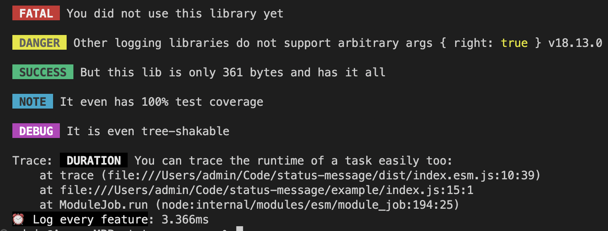

<h1 align="center">@jsheaven/status-message</h1>

> Prints colorful status messages to the console

<h2 align="center">User Stories</h2>

1. As a developer, I don't want to format log messages again and again using tags, ASCII color and `console` API

<h2 align="center">Features</h2>

- ✅ Does offer colorful logging function
- ✅ Severities are: `error(...)`, `warn(...)`, `log(...)`, `info(...)`, `debug(...)`, `trace(...)`
- ✅ Duration time measurements: `time(label: string)`, `timeEnd(label: string)`
- ✅ Uses the correct `console` API functions automatically (per severity)
- ✅ Available as a simple API
- ✅ Just `361 byte` nano sized (ESM, gizpped)
- ✅ Tree-shakable and side-effect free
- ✅ First class TypeScript support
- ✅ 100% Unit Test coverage

<h2 align="center">Example usage (API)</h2>

<h3 align="center">Setup</h3>

- yarn: `yarn add @jsheaven/status-message`
- npm: `npm install @jsheaven/status-message`

<h3 align="center">ESM</h3>

```ts
import { log, error, warn, info, debug, trace, time, timeEnd } from '@jsheaven/status-message'

time('Log every feature')

error('FATAL', 'You did not use this library yet')
warn('DANGER', 'Other logging libraries do not support arbitrary args', { right: true }, process.version)
log('SUCCESS', 'But this lib is only 361 bytes and has it all')
info('NOTE', 'It even has 100% test coverage')
debug('DEBUG', 'It is even tree-shakable')
trace('DURATION', 'You can trace the runtime of a task easily too:')

timeEnd('Log every feature')
```



<h3 align="center">CommonJS</h3>

```ts
const { log, logTime, logTimeEnd } = require('@jsheaven/status-message')

// same API like ESM variant
```
